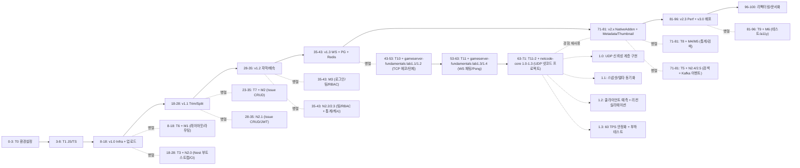

# ROADMAP for Portfolio Projects

## 1) 최소 튜토리얼 블록 정의 (진짜 필요한 것만)

각 스택별로 **프로젝트에서 실제로 쓰이는 것만** 정리한 튜토리얼 블록이다.

### Node / video-editor / Nest 공통

* **T1 – JS/TS 코어**

  * ES6+: 함수, 모듈, Promise, async/await
  * TS: 타입/인터페이스, 제네릭 기본, 유니온, 좁히기
  * 이건 4개 프로젝트 전부 공통 전제라서 완전 빼기는 불가능.

* **T2 – Node HTTP + ffmpeg CLI (video-editor v1.x용)**

  * Node 코어(fs, child_process), npm 스크립트
  * 간단한 Express/Fastify HTTP 서버 + 파일 업로드
  * ffmpeg/ffprobe 명령어로 **trim/split, 속도 조절, 자막 입히기** 정도

* **T3 – Nest 기본 뼈대 (N2.0 범위까지만)**

  * Nest 모듈/컨트롤러/서비스
  * @nestjs/config, 환경 분리
  * Prisma + SQLite 연동 (schema.prisma, 마이그레이션)
  * GitHub Actions CI (빌드 + 테스트)

* **T4 – DB + Redis + WebSocket 패턴 (video-editor v1.3 & N2.1~2.3 공용)**

  * PostgreSQL 기본 SQL(SELECT/INSERT/UPDATE/INDEX)
  * Prisma + Postgres 연결
  * Redis 기본: key/value, TTL, 캐시 패턴
  * ws / socket.io 중 하나로 WebSocket 서버/클라 기본
  * 여기서 learnt 패턴은 그대로 video-editor **프로젝트 저장 + 진행률 WebSocket + Redis 캐시**에 직결됨.

* **T5 – 고급 백엔드 패턴(검색/배치/이벤트) – N2.3~N2.5용만**

  * 스케줄러(@nestjs/schedule) + 배치 집계 + 캐시-aside
  * Elasticsearch: 인덱스/매핑/검색 쿼리 정도
  * Kafka: topic, producer, consumer, at-least-once / 멱등 처리 개념
  * 팀/RBAC 패턴 (OWNER/MANAGER/MEMBER)

(video-editor 본체는 Kafka/ES 까진 안 쓰지만, **별도 Nest 포트폴리오**가 목표라서 이 정도는 유지)

### React 프론트

* **T6 – React/Vite 기본 + 라우팅/레이아웃 (M1 범위)**

  * Vite + React + TS
  * React Router, 기본 레이아웃 (Header/Sidebar)

* **T7 – React Query + Axios + 폼(RHF+zod) (M2~M3 범위)**

  * React Query 기본(useQuery/useMutation, staleTime)
  * Axios 인스턴스 + 인터셉터
  * react-hook-form + zod 검증

* **T8 – 통계/검색 + URL 동기화 + 최적화 (M4~M5)**

  * 간단한 차트 컴포넌트
  * React Query로 통계/외부 API
  * useSearchParams + 커스텀 useQueryParams
  * React.memo/useMemo/useCallback 기본

* **T9 – 테스트/접근성 (M6)**

  * Vitest + React Testing Library + Playwright
  * 기본 WCAG 개념, aria-* 속성, 키보드 포커스

### C++ / 게임서버 / native-addon / 넷코드

* **T9.5 – C++ 기초 튜토리얼 (T10 사전 준비용, 선택)**

  * **목적**: T01 JS/TS 코어처럼 C++ 기초를 체계적으로 다룸. T10 고급 패턴 전제 지식 채움.
  * **내용** (T01과 유사한 구조):
    - **기본 문법**: 변수/타입, 연산자, 제어 구조 (if/loop/switch)
    - **함수와 모듈**: 함수 정의/호출, 헤더 파일, 네임스페이스
    - **객체 지향**: 클래스/객체, 생성자/소멸자, 상속/다형성 기초
    - **메모리 관리**: 포인터/참조, new/delete, 메모리 누수 이해
    - **STL 기초**: vector, string, map, 알고리즘 (sort, find)
    - **컴파일/디버그**: g++ 사용, gdb 기초, 에러 처리
    - **실습 프로젝트**: 간단한 콘솔 앱 (계산기, 파일 I/O)
  * **시간**: 2-4주 (T01과 비슷), 난이도: 초보자
  * **리소스**: cppreference.com, "C++ Primer" 챕터 1-10, 온라인 코스 (freeCodeCamp C++)
  * **완료 조건**: C++로 클래스 기반 프로그램 작성, STL 활용 가능

* **T10 – Modern C++17 + RAII + TCP 소켓 (lab1.1~1.2용)**

  * **사전 요구사항**: C++ 기본 지식 (변수, 함수, 클래스, 포인터). 없으면 아래 기초 문서 먼저 읽기.
    - 추천: "C++ Primer" 챕터 1-6 또는 온라인 튜토리얼 (cppreference.com, learncpp.com).
    - 대안: T01 JS/TS 코어 완료 후, 간단한 C++ Hello World부터 시작.
  * C++17 기초: lambda, auto, structured bindings, range-based for
  * RAII, smart pointer, move, std::thread, mutex
  * 에러 처리: exceptions vs error codes, noexcept
  * POSIX TCP 소켓 래핑 (accept, send/recv)
  * 단일 프로세스, 스레드 per connection 모델
  * 기본 패킷 직렬화/역직렬화 (바이너리 프로토콜 기초)
  * 네트워크 기초: IP/포트, 클라이언트-서버 모델

* **T11 – Boost.Asio/Beast WebSocket + 게임 루프 기초 (lab1.3~1.4용)**

  * io_context, async_accept/read/write
  * WebSocket 핸드셰이크와 프로토콜 이해
  * 멀티룸 채팅 서버 구조, 세션/룸 관리
  * WebSocket Pong 서버 구조, **게임 루프 + tick 기본**
  * 고정 타임스텝(fixed timestep) 패턴
  * 기본 상태 동기화 (브로드캐스트)
  * JSON 프로토콜 설계
  * 네트워크 시뮬레이션: 간단한 지연/손실 테스트 (netem 기초)

* **T11-2 – UDP 넷코드 + 권위 서버 (netcode-core 프로젝트용)**

  * **난이도**: 중급~고급 (T10/T11 완료 후 추천). 초보자는 T11-2.1부터 시작.
  * **gameserver-fundamentals와 별도 프로젝트**: lab1.1-1.4 완료 후 진행하는 독립 프로젝트
  * **T11-2.1 UDP 기초**: bind, sendto/recvfrom, non-blocking IO
  * **T11-2.2 신뢰성 레이어**: sequence number, ack, ack_bits (32-frame window)
  * **T11-2.3 권위 서버 패턴**: 클라이언트 입력 검증, 서버 시뮬레이션
  * **T11-2.4 스냅샷/델타 동기화**:
    * 키프레임(full snapshot) vs 델타 프레임(diff)
    * 델타 압축으로 대역폭 50% 절감
  * **T11-2.5 클라이언트 예측 + 리컨실리에이션**:
    * 입력 즉시 로컬 시뮬레이션
    * 서버 응답 수신 시 상태 비교, 재시뮬레이션(resim)
  * **T11-2.6 엔티티 보간**: 다른 플레이어 위치의 부드러운 렌더링
  * **60 TPS 게임 루프 안정화**: sleep_for 정밀도 제어, p99 < 15ms
  * **네트워크 시뮬레이션**: netem으로 지연/손실 주입, 안정성 검증
  * **메트릭 수집**: Prometheus 기반 성능 모니터링

* **T12 – Node-API + FFmpeg C API native addon (video-editor v2.x용)**

  * N-API로 C++ 모듈 빌드/바인딩
  * FFmpeg C API로 메타데이터 추출 / 썸네일
  * JS <-> C++ 타입 변환/에러 처리

* **T13 – Docker + 배포/모니터링 최소셋**

  * Dockerfile + docker-compose
  * Nginx reverse proxy + SSL
  * 기본 메트릭(프로메테우스 형식) + 로그 구조화
  * GitHub Actions로 빌드/배포 파이프라인

위 목록은 전부 **레포 설계 문서에 실제로 등장하는 기능을 구현하는 데 필요한 정도**만 남긴 상태다.
**특히 T11-2 UDP 넷코드는 게임 서버 개발자 포지션에 필수적인 실시간 동기화 역량을 증명하는 핵심 블록이다.**

---

## 2) 0 → 100 타임라인: video-editor 메인 축 + 가지 구조

전제:

* **0** = 이미 프로그래밍은 할 줄 아는데, 이 4개 프로젝트 스택은 "실제 코드로는 안 해본 상태"
* **100** = video-editor v3.0 + 3개 서브 프로젝트 모두 포트폴리오 레벨로 완성

### 2-1. 구간별 요약 표

> 각 구간에서 **먼저 튜토리얼 → 바로 옆 프로젝트에 사용**하도록 배치했다.

| 구간(대략)     | video-editor(메인)                                                        | Node/Nest 서브                                        | React 서브                                            | C++ 서버 서브                                         | 그 시점에 새로 배우는 튜토리얼                                                           |
| ---------- | ----------------------------------------------------------------------- | --------------------------------------------------- | --------------------------------------------------- | -------------------------------------------------- | --------------------------------------------------------------------------- |
| **0–3**    | 아직 시작 X                                                                 | –                                                   | –                                                   | –                                                  | **T0 개발 환경 설정** (Node.js, TypeScript, React, C++ CMake, 디버깅)                |
| **3–8**    | 아직 시작 X                                                                 | –                                                   | –                                                   | –                                                  | **T1 JS/TS 코어**                                                             |
| **8–18**   | **v1.0 기본 인프라 + 업로드** 시작/완료 (파일 업로드, ffmpeg 프로세스 실행)                    | –                                                   | **Milestone 1 (레이아웃/라우팅) 시작**                       | –                                                  | **T2 Node HTTP+ffmpeg**, **T6 React/Vite 기본**                               |
| **18–28**  | **v1.1 Trim/Split** 구현 (ffmpeg CLI로 잘라내기/분할)                            | **N2.0 Nest Bootstrap** 시작 (CI, Prisma+SQLite)      | M1 마무리                                              | –                                                  | **T3 Nest 기본** (T0, T1, T2 기반에서 바로 씀)                                       |
| **28–35**  | **v1.2 자막/배속 처리** (필터 몇 개 추가)                                           | **N2.1 Issue CRUD + JWT** (레이어드 아키텍처, Prisma 트랜잭션)  | **M2 Issue Tracker CRUD** (React Query + 폼)         | –                                                  | **T4 DB+Redis+WS의 "DB/CRUD 부분" + T7 React Query/RHF**                       |
| **35–43**  | **v1.3 WebSocket 진행률 + PostgreSQL 프로젝트 저장 + Redis 캐시** 완성               | **N2.2 팀/RBAC + N2.3 통계/캐시/외부 API** 진행              | **M3 로그인/팀/RBAC UX**                                | –                                                  | **T4 DB+Redis+WS 전체** (WebSocket/Redis 패턴을 여기서 학습→곧바로 v1.3에 적용)             |
| **43–53**  | 메인 기능 잠깐 유지보수만                                                          | –                                                   | –                                                   | **gameserver-fundamentals: lab1.1 TCP 에코 → lab1.2 턴제 전투**                  | **T10 Modern C++ + TCP 소켓 + 패킷 직렬화**                                        |
| **53–63**  | –                                                                       | –                                                   | –                                                   | **gameserver-fundamentals: lab1.3 WS 멀티룸 채팅 → lab1.4 Pong 게임 서버** | **T11 Boost.Asio/Beast WebSocket + 게임 루프 기초**                              |
| **63–71**  | –                                                                       | –                                                   | –                                                   | **netcode-core 프로젝트: 1.0 UDP 신뢰성 → 1.3 넷코드 완성**        | **T11-2 UDP 넷코드 (스냅샷/델타, 예측/리컨실리에이션, 60 TPS)**                             |
| **71–81**  | **v2.0 Native addon + v2.1 Thumbnail + v2.2 Metadata(FFmpeg C API)** 구현 | **N2.4 Elasticsearch 검색 + N2.5 Kafka 이벤트** 마무리      | **M4 통계 대시보드 + M5 상품 검색 페이지** (Stats/Search API 소비) | C++ 서버는 polishing (Redis 세션, PG 리더보드)               | **T12 Node-API + FFmpeg C API** + **T5 고급 백엔드(ES/Kafka)** + **T8 통계/검색 UI** |
| **81–96**  | **v2.3 성능 모니터링 + v3.0 프로덕션 배포 (Docker, Reverse proxy, 모니터링)**           | Nest 프로젝트도 Docker/배포/모니터링 최소 적용                     | **M6 테스트 & 접근성 (Playwright, a11y)**                 | 게임 서버도 메트릭/부하 테스트 추가                                | **T13 Docker/배포/모니터링** + **T9 테스트/접근성**                                     |
| **96–100** | v1~v3 코드 리팩터링, README/설계 문서/데모 영상 정리                                    | Node/Nest/React/C++ 4레포 포트폴리오화                      | 동일                                                  | 동일                                                 | 추가 튜토리얼 없음, 문서화/정리 단계                                                       |

**포인트**

* 각 구간에서 **새로 배우는 튜토리얼(Tx)** 은 _바로 옆 칸에 있는 버전/마일스톤에 즉시 사용_하게 붙여놨다.
* 예: **T4 DB+Redis+WS**를 배운 직후에 곧바로

  * Nest 쪽에서 DailyStats/캐시/외부 API 구현(N2.3) 하고,
  * 이어서 video-editor v1.3(WebSocket 진행률 + 프로젝트 저장 + Redis 메타데이터 캐시)로 바로 연결하는 식.

* **새롭게 추가된 넷코드 구간(60-68)**:

  * T11에서 배운 WebSocket 게임 루프 기초 위에 **UDP 프로토콜 신뢰성 계층**을 직접 구현
  * 게임 서버 핵심인 **스냅샷/델타 동기화, 클라이언트 예측, 서버 리컨실리에이션** 패턴 학습
  * 이 경험은 게임 서버 포지션 지원 시 **차별화된 실전 역량**으로 작용
  * 또한 네트워크 프로그래밍 깊이를 증명하여 C++ 백엔드/시스템 프로그래밍 포지션에도 강점

---

### 2-2. 네가 원했던 "0→100 축 + 가지" 느낌 (머메이드 스타일)

실제 실행 여부랑 상관없이, **정보만 보이게** 대략 이렇게 표현할 수 있다:



이 그림에서 보면:

* **video-editor 단계가 시간축을 이끌고**,
* 각 단계 근처에서

  * React / Nest / C++ 튜토리얼 + 서브 프로젝트가 **짧게 튀어나왔다가 다시 합류**하는 구조다.
* **C++ 쪽에서 익힌 네트워크/게임 루프/WS 감각**은 v2.x NativeAddon + 메트릭에 간접적으로 도움.
* **새롭게 강조된 넷코드 가지(C3)**:
  * **netcode-core 별도 프로젝트**(gameserver-fundamentals 이후 진행)에서 **UDP 신뢰성 계층, 스냅샷/델타, 예측/리컨실리에이션**을 실제 구현
  * 이는 게임 서버 개발자 포지션의 **핵심 차별화 요소**
  * 크래프톤/넥슨/넷마블 등 게임사 지원 시 **실전 넷코드 경험**으로 강력한 어필 포인트

---

## 3) 정리 – "병렬" 관점에서 다시 설명

질문 요지대로만 요약하면:

1. **튜토리얼 최소화**

   * 네 프로젝트 설계 문서에서 실제로 쓰는 기능만 역추적해서 T1~T13으로 압축했다.
   * **T11-2 UDP 넷코드 튜토리얼을 추가**하여 게임 서버 실전 역량 확보
   * 일반 이론/취미 공부용 튜토리얼은 잘라냈다.

2. **video-editor 중심 가지 구조**

   * video-editor v1.0 → v1.3 → v2.x → v3.0 을 시간축 메인으로 놓고,
   * 각 구간 바로 옆에

     * React Milestone (M1~M6)
     * Nest Milestone (N2.0~N2.5)
     * **C++ gameserver-fundamentals (lab1.1~1.4) + netcode-core 별도 프로젝트**
       를 **짧게 붙였다가 다시 합류**시키는 형태로 재배치했다.

3. **"배우고 바로 써먹기"**

   * T4(DB+Redis+WS) → 바로 N2.3 + v1.3
   * T12(Node-API+FFmpeg C API) → 바로 video-editor v2.x
   * T8(통계/검색 UI) → 바로 M4/M5
   * T10/T11(C++ 네트워크/WS) → 바로 gameserver-fundamentals lab1.1-1.4
   * **T11-2(UDP 넷코드) → 바로 netcode-core 프로젝트 1.0-1.3**
     * **스냅샷/델타 동기화**: 대역폭 최적화로 실시간 멀티플레이어 가능
     * **클라이언트 예측**: 네트워크 지연에도 부드러운 UX
     * **서버 리컨실리에이션**: 클라이언트-서버 불일치 해결
     * 이 패턴들은 **게임 서버 면접에서 깊이 있는 토론 가능**

4. **넷코드가 포트폴리오에 미치는 영향**

   * **게임 서버 개발자 포지션**: 단순 WebSocket 채팅이 아닌 **실전 UDP 넷코드 구현 경험**으로 차별화
   * **C++ 백엔드 포지션**: 저수준 네트워크 프로그래밍, 성능 최적화 역량 증명
   * **시스템 프로그래밍 포지션**: 프로토콜 설계, 신뢰성 계층 직접 구현 경험
   * **면접 강점**: "UDP에서 패킷 손실 어떻게 처리?", "클라이언트 예측과 서버 리컨실리에이션 차이?" 등 깊이 있는 질문에 실전 경험 기반 답변 가능

---

## 4) 넷코드 학습 로드맵 세부 사항

### 4-1. netcode-core 1.0: UDP 신뢰성 계층 + 권위 서버 기초

**목표**: TCP의 신뢰성을 UDP 위에서 직접 구현하고, 권위 서버 패턴 이해

**구현 내용**:
1. **UDP 소켓 기초**
   * bind, sendto/recvfrom
   * non-blocking IO + epoll/select
   * 패킷 직렬화 (헤더 + 페이로드)

2. **신뢰성 계층**
   * sequence number (패킷 순서)
   * ack (수신 확인)
   * ack_bits (32-frame window로 여러 패킷 일괄 확인)
   * 타임아웃 재전송

3. **권위 서버 패턴**
   * 클라이언트는 입력만 전송 (이동 방향, 점프 등)
   * 서버가 입력 검증 후 시뮬레이션
   * 서버 상태를 클라이언트에 브로드캐스트

4. **간단한 플레이어 이동 게임**
   * 2D 평면에서 WASD 이동
   * 서버가 위치 계산, 충돌 검사
   * 60 TPS 고정 타임스텝

**학습 효과**:
* UDP의 "unreliable" 특성을 직접 체험
* 신뢰성을 위한 ack/seq 메커니즘 이해
* 게임 서버 면접 단골 질문 "UDP를 게임에 쓰는 이유?" 답변 가능

---

### 4-2. netcode-core 1.1-1.3: 스냅샷/델타 + 예측/리컨실리에이션

**목표**: 실전 넷코드 최적화 기법 모두 구현

**구현 내용**:
1. **스냅샷/델타 동기화**
   * **키프레임(Snapshot)**: 10프레임마다 전체 상태 전송
   * **델타 프레임(Delta)**: 이전 프레임 대비 변경 사항만 전송
   * 델타 압축으로 대역폭 50% 절감
   * 클라이언트가 패킷 손실 시 다음 키프레임까지 대기

2. **클라이언트 예측(Client-side Prediction)**
   * 로컬 플레이어 입력을 즉시 시뮬레이션
   * 입력 버퍼에 최근 N개 입력 저장
   * 서버 응답 수신 시 예측 검증

3. **서버 리컨실리에이션(Server Reconciliation)**
   * 서버 상태와 클라이언트 예측 비교
   * 불일치 발견 시 서버 상태로 롤백
   * 입력 버퍼 기반 재시뮬레이션(resim)
   * 부드러운 보정 (lerp/slerp)

4. **엔티티 보간(Entity Interpolation)**
   * 다른 플레이어는 과거 상태로 렌더링
   * 2-3 프레임 지연 버퍼 유지
   * 보간으로 부드러운 이동

5. **네트워크 시뮬레이션**
   * netem으로 지연 100ms, 패킷 손실 5% 주입
   * 여전히 안정적 동작 확인

**학습 효과**:
* 게임 업계 표준 넷코드 기법 모두 실습
* "클라이언트 예측 없이 RTT 100ms면 어떻게 되나?" 실험 가능
* 면접에서 "넷코드 어떻게 최적화했나?" 질문에 수치 기반 답변
* 크래프톤/넥슨 같은 게임사 기술 면접 통과 가능 수준

---

### 4-3. 넷코드와 다른 프로젝트의 연결점

**video-editor와의 시너지**:
* WebSocket 실시간 통신 경험 → UDP 넷코드로 확장
* 성능 최적화 감각 (p99 latency) → 게임 서버 틱 처리 시간 최적화
* 메모리 풀 패턴 → 게임 서버 엔티티 풀 재사용

**NestJS Backend와의 시너지**:
* Redis 캐시 패턴 → 게임 서버 세션 관리
* PostgreSQL 트랜잭션 → 리더보드/인벤토리 영속화
* WebSocket 이벤트 → 게임 서버 브로드캐스트 패턴

**React Frontend와의 시너지**:
* 게임 클라이언트를 React로 구현 (Canvas + WebSocket)
* 실시간 상태 관리 → 게임 상태 렌더링
* 성능 최적화 (React.memo) → 게임 루프 렌더링 최적화

**전체적인 효과**:
* 4개 프로젝트가 **네트워크 실시간 통신**이라는 공통 주제로 연결
* 각 프로젝트에서 배운 패턴이 다른 프로젝트에 적용
* 포트폴리오 전체가 **일관된 스토리**를 가지게 됨

---

# ROADMAP for Algorithms & CS

알고리즘과 CS 기초 트랙은 **프로젝트와 독립적**으로 운영됩니다.

📖 **별도 문서로 분리되었습니다**: [ALGORITHMS-CS-ROADMAP.md](./ALGORITHMS-CS-ROADMAP.md)

## 요약

### 트랙 A: 알고리즘 & 코딩테스트
- **목표**: 백준 골드 1~3 수준
- **예상 시간**: 140-200시간
- **모듈**: A0 (준비) → A1 (실버) → A2 (골드) → A3 (심화) → A4 (유지)

### 트랙 B: CS 기초
- **목표**: 면접 대응 + 프로젝트 연계 설명
- **예상 시간**: 45-60시간
- **모듈**: B1 (OS) + B2 (네트워크) + B3 (DB)

### 추천 학습 순서
```
A0 (준비) → A1 (실버) → A2 (골드) + B1/B2 병행 → A3 (선택) + B3
```

자세한 내용은 [ALGORITHMS-CS-ROADMAP.md](./ALGORITHMS-CS-ROADMAP.md)를 참조하세요.
