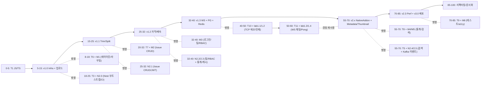

# ROADMAP for Portfolio Projects

## 1) 최소 튜토리얼 블록 정의 (진짜 필요한 것만)

각 스택별로 **프로젝트에서 실제로 쓰이는 것만** 정리한 튜토리얼 블록이다.

### Node / video-editor / Nest 공통

* **T1 – JS/TS 코어**

  * ES6+: 함수, 모듈, Promise, async/await
  * TS: 타입/인터페이스, 제네릭 기본, 유니온, 좁히기
  * 이건 4개 프로젝트 전부 공통 전제라서 완전 빼기는 불가능.

* **T2 – Node HTTP + ffmpeg CLI (video-editor v1.x용)**

  * Node 코어(fs, child_process), npm 스크립트
  * 간단한 Express/Fastify HTTP 서버 + 파일 업로드
  * ffmpeg/ffprobe 명령어로 **trim/split, 속도 조절, 자막 입히기** 정도

* **T3 – Nest 기본 뼈대 (N2.0 범위까지만)** 

  * Nest 모듈/컨트롤러/서비스
  * @nestjs/config, 환경 분리
  * Prisma + SQLite 연동 (schema.prisma, 마이그레이션)
  * GitHub Actions CI (빌드 + 테스트)

* **T4 – DB + Redis + WebSocket 패턴 (video-editor v1.3 & N2.1~2.3 공용)**

  * PostgreSQL 기본 SQL(SELECT/INSERT/UPDATE/INDEX)
  * Prisma + Postgres 연결
  * Redis 기본: key/value, TTL, 캐시 패턴
  * ws / socket.io 중 하나로 WebSocket 서버/클라 기본
  * 여기서 learnt 패턴은 그대로 video-editor **프로젝트 저장 + 진행률 WebSocket + Redis 캐시**에 직결됨.

* **T5 – 고급 백엔드 패턴(검색/배치/이벤트) – N2.3~N2.5용만**

  * 스케줄러(@nestjs/schedule) + 배치 집계 + 캐시-aside
  * Elasticsearch: 인덱스/매핑/검색 쿼리 정도
  * Kafka: topic, producer, consumer, at-least-once / 멱등 처리 개념
  * 팀/RBAC 패턴 (OWNER/MANAGER/MEMBER)

(video-editor 본체는 Kafka/ES 까진 안 쓰지만, **별도 Nest 포트폴리오**가 목표라서 이 정도는 유지)

### React 프론트

* **T6 – React/Vite 기본 + 라우팅/레이아웃 (M1 범위)** 

  * Vite + React + TS
  * React Router, 기본 레이아웃 (Header/Sidebar)

* **T7 – React Query + Axios + 폼(RHF+zod) (M2~M3 범위)**

  * React Query 기본(useQuery/useMutation, staleTime)
  * Axios 인스턴스 + 인터셉터
  * react-hook-form + zod 검증

* **T8 – 통계/검색 + URL 동기화 + 최적화 (M4~M5)**

  * 간단한 차트 컴포넌트
  * React Query로 통계/외부 API
  * useSearchParams + 커스텀 useQueryParams
  * React.memo/useMemo/useCallback 기본

* **T9 – 테스트/접근성 (M6)** 

  * Vitest + React Testing Library + Playwright
  * 기본 WCAG 개념, aria-* 속성, 키보드 포커스

### C++ / 게임서버 / native-addon

* **T10 – Modern C++17 + RAII + TCP 소켓 (lab1.1~1.2용)**

  * RAII, smart pointer, move, std::thread, mutex
  * POSIX TCP 소켓 래핑 (accept, send/recv)
  * 단일 프로세스, 스레드 per connection 모델

* **T11 – Boost.Asio/Beast WebSocket (lab1.3~1.4용)**

  * io_context, async_accept/read/write
  * 멀티룸 채팅 서버 구조, 세션/룸 관리
  * WebSocket Pong 서버 구조, 게임 루프 + tick

* **T12 – Node-API + FFmpeg C API native addon (video-editor v2.x용)**

  * N-API로 C++ 모듈 빌드/바인딩
  * FFmpeg C API로 메타데이터 추출 / 썸네일
  * JS <-> C++ 타입 변환/에러 처리

* **T13 – Docker + 배포/모니터링 최소셋**

  * Dockerfile + docker-compose
  * Nginx reverse proxy + SSL
  * 기본 메트릭(프로메테우스 형식) + 로그 구조화
  * GitHub Actions로 빌드/배포 파이프라인

위 목록은 전부 **레포 설계 문서에 실제로 등장하는 기능을 구현하는 데 필요한 정도**만 남긴 상태다.

---

## 2) 0 → 100 타임라인: video-editor 메인 축 + 가지 구조

전제:

* **0** = 이미 프로그래밍은 할 줄 아는데, 이 4개 프로젝트 스택은 “실제 코드로는 안 해본 상태”
* **100** = video-editor v3.0 + 3개 서브 프로젝트 모두 포트폴리오 레벨로 완성

### 2-1. 구간별 요약 표

> 각 구간에서 **먼저 튜토리얼 → 바로 옆 프로젝트에 사용**하도록 배치했다.

| 구간(대략)     | video-editor(메인)                                                        | Node/Nest 서브                                        | React 서브                                            | C++ 서버 서브                                | 그 시점에 새로 배우는 튜토리얼                                                           |
| ---------- | ----------------------------------------------------------------------- | --------------------------------------------------- | --------------------------------------------------- | ---------------------------------------- | --------------------------------------------------------------------------- |
| **0–5**    | 아직 시작 X                                                                 | –                                                   | –                                                   | –                                        | **T1 JS/TS 코어**                                                             |
| **5–15**   | **v1.0 기본 인프라 + 업로드** 시작/완료 (파일 업로드, ffmpeg 프로세스 실행)                    | –                                                   | **Milestone 1 (레이아웃/라우팅) 시작**                       | –                                        | **T2 Node HTTP+ffmpeg**, **T6 React/Vite 기본**                               |
| **15–25**  | **v1.1 Trim/Split** 구현 (ffmpeg CLI로 잘라내기/분할)                            | **N2.0 Nest Bootstrap** 시작 (CI, Prisma+SQLite)      | M1 마무리                                              | –                                        | **T3 Nest 기본** (T1, T2 기반에서 바로 씀)                                           |
| **25–32**  | **v1.2 자막/배속 처리** (필터 몇 개 추가)                                           | **N2.1 Issue CRUD + JWT** (레이어드 아키텍처, Prisma 트랜잭션)  | **M2 Issue Tracker CRUD** (React Query + 폼)         | –                                        | **T4 DB+Redis+WS의 “DB/CRUD 부분” + T7 React Query/RHF**                       |
| **32–40**  | **v1.3 WebSocket 진행률 + PostgreSQL 프로젝트 저장 + Redis 캐시** 완성               | **N2.2 팀/RBAC + N2.3 통계/캐시/외부 API** 진행              | **M3 로그인/팀/RBAC UX**                                | –                                        | **T4 DB+Redis+WS 전체** (WebSocket/Redis 패턴을 여기서 학습→곧바로 v1.3에 적용)             |
| **40–50**  | 메인 기능 잠깐 유지보수만                                                          | –                                                   | –                                                   | **lab1.1 TCP 에코 → lab1.2 턴제 전투**         | **T10 Modern C++ + TCP 소켓**                                                 |
| **50–60**  | –                                                                       | –                                                   | –                                                   | **lab1.3 WS 멀티룸 채팅 → lab1.4 Pong 게임 서버** | **T11 Boost.Asio/Beast WebSocket**                                          |
| **55–70**  | **v2.0 Native addon + v2.1 Thumbnail + v2.2 Metadata(FFmpeg C API)** 구현 | **N2.4 Elasticsearch 검색 + N2.5 Kafka 이벤트** 마무리      | **M4 통계 대시보드 + M5 상품 검색 페이지** (Stats/Search API 소비) | C++ 서버는 polishing                        | **T12 Node-API + FFmpeg C API** + **T5 고급 백엔드(ES/Kafka)** + **T8 통계/검색 UI** |
| **70–85**  | **v2.3 성능 모니터링 + v3.0 프로덕션 배포 (Docker, Reverse proxy, 모니터링)**           | Nest 프로젝트도 Docker/배포/모니터링 최소 적용                     | **M6 테스트 & 접근성 (Playwright, a11y)**                 | 필요시 간단 메트릭 추가                            | **T13 Docker/배포/모니터링** + **T9 테스트/접근성**                                     |
| **85–100** | v1~v3 코드 리팩터링, README/설계 문서/데모 영상 정리                                    | Node/Nest/React/C++ 4레포 포트폴리오화                      | 동일                                                  | 동일                                       | 추가 튜토리얼 없음, 문서화/정리 단계                                                       |

**포인트**

* 각 구간에서 **새로 배우는 튜토리얼(Tx)** 은 _바로 옆 칸에 있는 버전/마일스톤에 즉시 사용_하게 붙여놨다.
* 예: **T4 DB+Redis+WS**를 배운 직후에 곧바로

  * Nest 쪽에서 DailyStats/캐시/외부 API 구현(N2.3) 하고,
  * 이어서 video-editor v1.3(WebSocket 진행률 + 프로젝트 저장 + Redis 메타데이터 캐시)로 바로 연결하는 식.

---

### 2-2. 네가 원했던 “0→100 축 + 가지” 느낌 (머메이드 스타일)

실제 실행 여부랑 상관없이, **정보만 보이게** 대략 이렇게 표현할 수 있다:

이 그림에서 보면:

* **video-editor 단계가 시간축을 이끌고**,
* 각 단계 근처에서

  * React / Nest / C++ 튜토리얼 + 서브 프로젝트가 **짧게 튀어나왔다가 다시 합류**하는 구조다.
* C++ 쪽에서 익힌 **네트워크/게임 루프/WS 감각**은 v2.x NativeAddon + 메트릭에 간접적으로 도움.

---

## 3) 정리 – “병렬” 관점에서 다시 설명

질문 요지대로만 요약하면:

1. **튜토리얼 최소화**

   * 네 프로젝트 설계 문서에서 실제로 쓰는 기능만 역추적해서 T1~T13으로 압축했다.
   * 일반 이론/취미 공부용 튜토리얼은 잘라냈다.

2. **video-editor 중심 가지 구조**

   * video-editor v1.0 → v1.3 → v2.x → v3.0 을 시간축 메인으로 놓고,
   * 각 구간 바로 옆에

     * React Milestone (M1~M6)
     * Nest Milestone (N2.0~N2.5)
     * C++ lab (1.1~1.4)
       를 **짧게 붙였다가 다시 합류**시키는 형태로 재배치했다.

3. **“배우고 바로 써먹기”**

   * T4(DB+Redis+WS) → 바로 N2.3 + v1.3
   * T12(Node-API+FFmpeg C API) → 바로 video-editor v2.x
   * T8(통계/검색 UI) → 바로 M4/M5
   * T10/T11(C++ 네트워크/WS) → 바로 lab1.x

# ROADMAP for Algorithms & CS

핵심만 정리해서 “별도 CS+코테 트랙” 하나로 짠다.
이 트랙은 **프로젝트랑 독립**이고, 목표는 두 개다:

1. 현실적인 기준선 체크리스트 커버 (DS/알고, OS, 네트워크, DB)
2. 코테: **백준 골드 상위(골드 1~3 근처)** 대응

아래 커리큘럼 그대로 따라가면 된다.

---

## 전체 구조

* **트랙 A – 알고리즘/코테 (백준 골드 상위)**
* **트랙 B – CS 기초 (OS / 네트워크 / DB)**

각 트랙은 다시 모듈로 나눈다.
순서는:

> **A1 → A2 → (A3 병행) + B1/B2/B3**

---

## 트랙 A – 알고리즘 / 코딩테스트 (백준 골드 상위 목표)

### A0. 준비 단계 (환경/습관 세팅)

**목표**

* 백준 문제 아무거나 골라도, **입출력/시간초과/메모리초과** 정도는 스스로 디버깅 가능

**해야 할 것**

* 언어 하나 확정 (C++ or Java or Python)
* 빠른 입출력 세팅
* 재귀 깊이 제한 설정/스택오버플로 대처
* 기본 템플릿:

  * 입력 파싱 템플릿
  * 그래프 저장 템플릿 (인접 리스트)
  * BFS/DFS 기본 함수
  * 우선순위 큐, Union-Find 기본 구현

---

### A1. 실버 전 구간 정리 (기본기: 골드로 가기 위한 바닥)

**목표**

* 백준 실버 1~2는 **안 보고 구현** 수준
* 여기서 다지는 건 전부 골드에 그대로 쓰인다.

**토픽**

1. **기본 자료구조**

   * 배열, 리스트, 스택, 큐, 덱
   * 정렬(O(N log N)), 이분 탐색
2. **완전 탐색 & 백트래킹**

   * 순열/조합, 부분수열
   * N-Queen/N과 M류 패턴
3. **그리디 기본**

   * 정렬 후 선택, 간단한 증명(“역전 사례가 있나?” 정도)
4. **기본 그래프 + BFS/DFS**

   * 인접 리스트, 방문 배열
   * 연결 요소, 최단거리(BFS), Flood Fill
5. **기본 DP**

   * 1차원 DP(계단 오르기, 동전, LIS 기초)
   * 2차원 DP(배낭, LCS 기초)
6. **구간 합 & 누적합**

   * 1D prefix sum, 2D prefix sum

**연습 규칙(추천)**

* 각 토픽마다:

  * 실버 3~5문제 + 실버 상위(1~2) 3~5문제
* 전부 합쳐서 대략 **실버 문제 80~120문제** 정도 각오.

---

### A2. 골드 하위~중위 (골4~골2 메인 영역)

**목표**

* 골드 하위(골4~3)는 토픽 맞으면 대부분 맞춘다.
* 골2~1 쉬운 문제는 시간 내에 접근 가능.

**토픽**

1. **그래프 심화**

   * 가중치 그래프: Dijkstra, Bellman-Ford 기본
   * 최단경로 복원 (부모 배열)
   * 위상 정렬 (DAG)
2. **Union-Find (Disjoint Set)**

   * 크루스칼 MST
   * 집합/연결성 관리 문제
3. **고급 BFS/DFS 패턴**

   * 상태공간 그래프 (bitmask + BFS, 여러 차원)
   * 0-1 BFS, 다중 시작점 BFS
4. **DP 심화**

   * Knapsack 변형, LIS O(N log N)
   * DP on Grid + 장애물/조건 추가
   * 간단한 비트마스크 DP
5. **Two Pointers / 슬라이딩 윈도우**

   * 구간 최솟값/최댓값, 합/조건 만족 구간 찾기
6. **구간 자료구조 입문**

   * 세그먼트 트리 혹은 펜윅 트리(하나만 확실히)
   * 구간 합, 구간 최댓값 정도

**연습 규칙(추천)**

* 각 토픽마다:

  * 실버 상위 2~3문제 → 골드 4~8문제
* 전체 합쳐서 **골드 문제 120~180문제** 정도.

여기까지가 “골드 상위 접근 가능”을 위한 실질적인 코어.

---

### A3. 골드 상위(골2~골1)용 선택 심화

**목표**

* **모든 걸 다 마스터가 아니라, “툴로 쓸 수 있는 정도로 한 번은 밟아본다”**가 목표.

**필수 추천**

1. **트리/그래프 심화**

   * LCA (최소 공통 조상)
   * 트리 DP (서브트리 정보 합치기)
2. **그래프 알고리즘**

   * SCC (Kosaraju/Tarjan)
   * 2-SAT 구조 정도 맛만 보기
3. **네트워크 플로우(선택)**

   * Ford-Fulkerson / Edmonds-Karp
   * 이분 매칭/최대 유량 기본

**연습 규칙**

* 각 토픽에서 골드/플래 문제 섞어 3~5문제씩만 “찍고 나온다”는 마인드.
* 이 영역은 **실패를 많이 겪으면서 감각을 쌓는 구간**이라
  모든 문제를 완벽 이해하려고 시간 과하게 쓰지 말 것.

---

### A4. 운영 루틴 (골드 상위 유지용)

튜토리얼 다 돌고 난 뒤의 “유지 루틴”:

* 주 3~5일 기준:

  * **새로운 골드 문제 1~2개**
  * **기존에 풀었던 문제 복습 1개** (특히 DP/그래프/세그먼트 트리)
* 한 달에 1번 정도:

  * 골드/플랫 레벨 **모의고사(2~3시간 잡고 연속 3~4문제)**

---

## 트랙 B – CS 기본 튜토리얼 (OS / 네트워크 / DB)

이건 **순수 이론 강의용이 아니라, “면접에서 버티기 + 네 프로젝트 설명에 근거 줄 정도”**까지만.

### B1. OS 기초

**목표**

* “프로세스/스레드/컨텍스트 스위칭/락/데드락” 얘기를
  **면접에서 본인 말로 설명할 수 있는 수준.**

**내용**

1. 프로세스 vs 스레드

   * 주소공간, PCB/TCB 개념
2. 문맥 전환(Context Switch)

   * 언제 일어나는지, 큰 cost 포인트는 어디인지
3. 동기화 기초

   * 뮤텍스/세마포어 개념
   * 데드락 4조건, 회피 방법(락 순서, 타임아웃)
4. 메모리 기초

   * 스택/힙/데이터/코드 영역
   * 동적 할당(new/malloc)과 해제, C++ RAII와 연결
5. 시스템 콜

   * 유저모드/커널모드 구분, 예시(IO, 소켓 등)

**아웃풋**

* A4 한 장 분량으로:

  * “프로세스 vs 스레드”
  * “컨텍스트 스위칭은 무엇이며 왜 비싼가”
  * “락과 데드락 예시”
    를 정리해서 말로 설명할 수 있게 만들 것.

---

### B2. 네트워크 기초

**목표**

* HTTP/HTTPS, TCP, WebSocket 관련 질문을
  **네 프로젝트(video-editor, Nest, 게임서버) 기준으로 설명 가능**.

**내용**

1. TCP vs UDP

   * 신뢰성/순서/흐름 제어, 언제 어느 걸 쓰는지
2. TCP 3-way handshake & 종료

   * SYN, SYN/ACK, ACK, Keep-alive 개념
3. HTTP/HTTPS

   * 요청/응답 구조, 메서드(GET/POST/PUT/DELETE)
   * 상태코드(2xx/3xx/4xx/5xx) 의미
   * Keep-Alive, Connection Pool 간단히
4. WebSocket

   * HTTP 업그레이드로 시작되는 구조
   * 왜 실시간에 적합한지, Ping/Pong
5. DNS & 간단한 요청 흐름

   * 브라우저에서 URL 치면 어떤 경로로 서버까지 가는지 큰 흐름

**아웃풋**

* 다음 질문을 종이에 그림 그려가며 답할 수 있으면 통과:

  * “브라우저에서 video-editor 업로드 요청을 보낼 때, 네트워크 관점에서 무슨 일이 일어나냐?”
  * “게임서버 WebSocket 연결은 TCP/HTTP랑 어떻게 다르냐?”

---

### B3. DB 기초

**목표**

* 본인이 만든 Nest/Node, video-editor, 게임서버에서의
  **쿼리/트랜잭션/인덱스/락 이슈를 설명할 수 있는 수준.**

**내용**

1. 관계형 모델

   * 테이블/행/열, PK/FK 기본
   * 정규화: 1NF/2NF/3NF 직관 (중복 제거, 갱신 이상)
2. 인덱스

   * B-Tree 인덱스 개념
   * 인덱스로 성능이 좋아지는 경우/안 먹는 경우
   * 복합 인덱스(컬럼 순서 중요)
3. 트랜잭션 & 격리수준

   * ACID
   * Read Uncommitted / Committed / Repeatable / Serializable
     → “각 단계에서 어떤 이상 상태가 생기는지” 예시.
4. 락 & 경쟁

   * Row-level lock, deadlock
   * long transaction의 문제
5. ORM 관점

   * N+1 문제, Eager vs Lazy loading
   * Prisma/Nest에서의 트랜잭션 패턴을 본인 프로젝트와 연결

**아웃풋**

* 본인 포트폴리오 DB 설계를 들고 와서:

  * “이 테이블에 어떤 인덱스를 왜 걸었는지”
  * “이 API가 동시 호출될 때 어떤 락/경쟁이 생길 수 있는지”
  * “트랜잭션 롤백이 언제 발생하는지”
    를 설명할 수 있으면 된다.

---

## 어떻게 병행할지 (추천 흐름)

이 CS+코테 트랙은 **프로젝트랑 완전히 분리**해서 진행한다고 했으니까,
현실적으로는 이렇게 보는 게 깔끔하다:

1. **1단계**

   * 트랙 A: **A1 (실버 전 구간 정리)**
   * 트랙 B: 아직 안 해도 됨.
     → 코테 몸풀기 + 기본 문제 풀이 감각부터.

2. **2단계**

   * 트랙 A: **A2 (골드 하위~중위)**
   * 트랙 B: **B1(OS)**, **B2(네트워크)**
     → 골드 문제 풀면서, 이론 질문 대응력을 같이 쌓는 구간.

3. **3단계**

   * 트랙 A: **A3(선택 심화) + A4(루틴)**
   * 트랙 B: **B3(DB)**
     → 골드 상위 영역 테스트 + 면접용 DB 기반 정리.

이 커리큘럼은 “필요 이상으로 넓게” 안 퍼뜨리고,
**골드 상위 + 실무 면접 기반 CS**만 찍어서 만든 거라,
그대로 가져다가 할당 시간만 네 상황에 맞게 조정하면 된다.