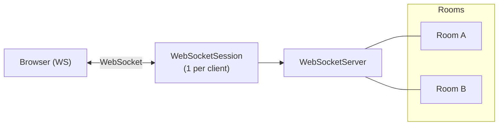

# WebSocket 멀티룸 채팅 서버 설계 일지 (C++ / Boost.Beast)
> 이 글은 WebSocket 멀티룸 채팅 서버를 C++로 구현하기 전에, 설계 과정을 기록해 둔 메모이다
## 0. 개요
### 0.1 프로젝트 목적
이 프로젝트는 **학습용 + 실전용 사이 어딘가**에 위치한 WebSocket 텍스트 채팅 서버를 만드는 것이 목표다
* **학습 측면**
  * C++17 + Boost.Asio/Boost.Beast 비동기 I/O 패턴 학습
  * RAII, `shared_ptr` / `weak_ptr` 기반 수명 관리
  * 간단한 JSON 프로토콜 설계/구현 연습
* **실용 측면**
  * 여러 클라이언트가 여러 개의 채팅 룸에 참여
  * 닉네임 변경, 룸/멤버 목록 조회 같은 기본 기능 제공
  * 수백~수천 세션까지는 충분히 버틸 구조
목표는 "운영 서비스급"이 아니라 **깔끔하고 확장 가능한 레퍼런스 서버**다
### 0.2 기능 범위
필수 기능:
* WebSocket 기반 텍스트 채팅
* 멀티 세션 / 멀티 룸
* 한 세션이 여러 룸에 동시에 참여 가능
* 룸 단위 메시지 브로드캐스트
* 닉네임 변경 (NICK)
* 룸 목록 조회 (LIST_ROOMS)
* 룸 멤버 목록 조회 (LIST_MEMBERS)
* 브라우저(HTML) 기반 테스트 클라이언트 제공

비범위:
* 인증 / 로그인
* 영구 룸 관리(서버 재시작 후 유지)
* 메시지 영구 저장 / 검색
* 샤딩 / 멀티 프로세스 분산
### 0.3 비기능 요구사항 / 제약
* 언어: **C++17**
* 네트워킹 라이브러리: **Boost.Asio**
* WebSocket: **Boost.Beast**
* JSON:
  * "수제 파서"
  * key/value 모두 문자열만 지원
  * `{ "key": "value" }` 정도 수준
* 프로세스:
  * 단일 프로세스, 단일 `io_context`
  * `io_context.run()` 스레드 1개로 시작
  * 구조적으로는 멀티 스레드로 확장 가능하게 설계
* 동시성:
  * 세션/룸/서버 전체 상태는 `mutex`로 보호
  * 명시적인 락 순서 규칙 정의 (데드락 방지)
* 스케일:
  * 수백 ~ 수천 세션 가정
  * O(N) 닉네임 검색 정도는 허용
### 0.4 소스 구성
C++ 서버:
* `main.cpp`
* `websocket_server.{h,cpp}`
* `websocket_session.{h,cpp}`
* `room.{h,cpp}`

브라우저 클라이언트:
* `test_client.html`
## 1. 상위 아키텍처
### 1.1 구성요소 다이어그램 (논리)

**WebSocketSession**
* 각 클라이언트 커넥션 하나씩 대응
* WebSocket 업그레이드, 수신/송신, JSON 명령 처리

**WebSocketServer**
* TCP acceptor
* 전체 세션 목록
* room ID → `Room` 매핑 관리
* room 관련 헬퍼 제공

**Room**
* 특정 room에 속한 세션들의 약한 참조 목록
* broadcast 헬퍼

**Browser**
* `test_client.html`에서 JS로 WebSocket 연결
* JSON 명령 전송, 서버 응답 표시
### 1.2 데이터 흐름 (명령 단위)
1. 클라이언트 → 서버:
   * WebSocket 텍스트 프레임에 JSON 문자열
   * 예: `{"cmd":"MSG","room":"lobby","text":"hi"}`
2. `WebSocketSession::on_read`:
   * `buffer_` → `std::string` → 수제 JSON 파서
   * `handle_command(fields)` 호출
3. 명령 처리:
   * JOIN/LEAVE/MSG/NICK/LIST_* 등의 핸들러가 `WebSocketServer`/`Room` 호출
   * 필요한 경우 broadcast
4. 서버 → 클라이언트:
   * WebSocket 텍스트 프레임으로 JSON 문자열
   * `send(std::string)` 경유 (큐 직렬화)
### 1.3 세션 수명
1. TCP 연결 수락
2. WebSocket 업그레이드 (`async_accept`)
3. 세션 등록 + 초기 INFO 전송
4. `do_read()` 루프:
   * 명령 처리, 응답/브로드캐스트
5. 종료 트리거:
   * 클라이언트 close 프레임
   * 네트워크 에러/EOF
   * 서버 `close()` 호출
6. 종료 처리:
   * `leave_all_rooms()`
   * 서버에서 세션 언레지스터
   * WebSocket 스트림 shutdown
## 2. 프로토콜 설계
### 2.1 공통 규칙
* 인코딩: UTF-8 가정 (깊게 안 다룸)
* 프레임: WebSocket **텍스트** 프레임
* JSON:
  * 꼭 `{}` 형태, key/value는 쌍따옴표 문자열
* 방향:
  * 클라이언트 → 서버: `cmd` 필드 필수
  * 서버 → 클라이언트: `type` 필드 필수
* 에러:
  * 잘못된 JSON / 필드 누락 / 비즈니스 룰 위반 → `ERROR` 메시지
  * 세션은 끊지 않음
### 2.2 클라이언트 → 서버 명령
| cmd            | 필수 필드      | 설명                  |
| -------------- | -------------- | --------------------- |
| `JOIN`         | `room`         | room 참가             |
| `LEAVE`        | `room`         | room 탈퇴             |
| `MSG`          | `room`, `text` | room 내 메시지 전송   |
| `NICK`         | `name`         | 닉네임 변경           |
| `LIST_ROOMS`   | (없음)         | 서버의 전체 room 목록 |
| `LIST_MEMBERS` | `room`         | 특정 room의 멤버 목록 |
예시:
```json
{ "cmd": "JOIN", "room": "lobby" }
{ "cmd": "MSG", "room": "lobby", "text": "hello" }
{ "cmd": "NICK", "name": "seungwoo" }
{ "cmd": "LIST_ROOMS" }
{ "cmd": "LIST_MEMBERS", "room": "lobby" }
```
### 2.3 서버 → 클라이언트 메시지
| type          | 필드                                    | 설명                         |
| ------------- | --------------------------------------- | ---------------------------- |
| `INFO`        | `message`                               | 일반 안내                    |
| `ERROR`       | `message`                               | 에러 설명                    |
| `JOINED`      | `room`                                  | 해당 room join 성공          |
| `LEFT`        | `room`                                  | 해당 room leave 성공         |
| `MSG`         | `room`, `from`, `text`                  | 채팅 또는 시스템 메시지      |
| `ROOM_LIST`   | `rooms` (문자열: `"lobby:3,general:5"`) | room/인원 목록               |
| `MEMBER_LIST` | `room`, `members` (`"a,b,c"` 문자열)    | 특정 room의 멤버 닉네임 목록 |
| `NICK_OK`     | `name`                                  | 닉네임 변경 성공             |
에러 예시:
```json
{ "type": "ERROR", "message": "Invalid JSON payload" }
{ "type": "ERROR", "message": "Already joined room" }
{ "type": "ERROR", "message": "Nickname already in use" }
```
MSG 예시:
```json
{
  "type": "MSG",
  "room": "lobby",
  "from": "seungwoo",
  "text": "hello"
}
```
시스템 메시지 예시:
```json
{
  "type": "MSG",
  "room": "lobby",
  "from": "server",
  "text": "seungwoo joined the room"
}
```
## 3. 단계별 구현 계획 (구현 순서 기준)
"실제로 코딩할 때 어떤 순서로 파일을 채워갈지"
### 3.1 1단계: 프로젝트 뼈대 & 서버 부트스트랩 (`main.cpp`)
**목표:**
프로세스가 포트를 열고 `io_context`를 돌리는 수준까지

작업:
1. `main.cpp`
   * `argc, argv`에서 포트 인자 파싱
   * 인자가 없으면 기본 포트(예: `8080`)
2. `boost::asio::io_context ioc{1};`
3. `WebSocketServer server{ioc, port};`
4. `server.run();`
5. `ioc.run();`
6. `try/catch`로 `std::exception` 잡아서 로그 후 `EXIT_FAILURE`

체크포인트:
  * 컴파일 성공
  * 포트 바인딩 실패 시 예외 제대로 터지는지 확인 (예: 이미 점유된 포트)
### 3.2 2단계: WebSocketServer 골격 (TCP 서버)
파일: `websocket_server.{h,cpp}`

**필드 정의**
```cpp
boost::asio::io_context& ioc_;
tcp::acceptor acceptor_;

std::vector<std::weak_ptr<WebSocketSession>> sessions_;
std::mutex sessions_mutex_;

std::map<std::string, std::shared_ptr<Room>> rooms_;
std::mutex rooms_mutex_;

bool stopping_ = false;
```
**생성자**
* `acceptor_.open(tcp::v4())`
* `set_option(reuse_address(true))`
* `bind(endpoint(port))`
* `listen()`
* 실패 시 예외

**run/do_accept/on_accept**
* `run()`에서 `do_accept()` 호출
* `do_accept()`에서 `async_accept`
* `on_accept`:
  * 에러: 로그 → `!stopping_ && acceptor_.is_open()`이면 다시 `do_accept()`
  * 성공:
    * `WebSocketSession` 생성(`shared_ptr`)
    * `session->run()`
    * 다시 `do_accept()`

체크포인트:
* 클라이언트가 TCP로 접속하면, `on_accept`까지 도달하는지 로그로 확인
* 아직 WebSocket 업그레이드/echo는 없음
### 3.3 3단계: WebSocketSession 골격 + Echo 서버
파일: `websocket_session.{h,cpp}`

**필드**
* `ws_`, `buffer_`, `server_`, `write_queue_`, `open_` 등.

**생성자**
* `ws_(std::move(socket))`
* `open_ = false;`

**run / on_accept**
* `run()`에서 `ws_.async_accept(...)`
* `on_accept`:
  * 에러 → 종료
  * 성공:
    * `open_ = true`
    * `server_.register_session(self)` (나중에 구체화)
    * `do_read()` 시작

**do_read / on_read**
* `async_read(buffer_, ...)`
* `on_read`:
  * 에러: 종료 로직
  * 정상:
    * `buffer_` → `std::string` (payload)
    * 초기에는 단순히 `send(payload)` (echo)
    * `buffer_.consume(buffer_.size())`
    * 다시 `do_read()`

**send / do_write / on_write**
* `send`: 큐에 push, 큐 크기 1이면 `do_write`
* `do_write`: `write_queue_.front()`로 `async_write`
* `on_write`: 에러시 종료, 아니면 pop 후 큐 남으면 다시 `do_write`

체크포인트:
* `test_client.html` 없이도 브라우저 콘솔/간단 JS로 접속해서 echo 동작 확인 가능
## 4. Room / 멀티 룸 구조 설계
### 4.1 Room 클래스 (`room.{h,cpp}`)
**필드**
```cpp
std::string id_;
std::vector<std::weak_ptr<WebSocketSession>> members_;
mutable std::mutex members_mutex_;
```
**주요 메서드**
* `Room(std::string id);`
* `const std::string& id() const;`
```cpp
void join(std::shared_ptr<WebSocketSession> session);
void leave(std::shared_ptr<WebSocketSession> session);
void broadcast(const std::string& message,
               std::shared_ptr<WebSocketSession> sender);
bool empty() const;
```
**구현 디테일**
* `join`:
  * `members_mutex_` 잠금
  * expired 세션 정리
  * 동일 세션이 이미 있으면 제거 후 다시 push
* `leave`:
  * `members_mutex_` 잠금
  * 주어진 세션과 expired 세션 제거
* `broadcast`:
  * 잠금 상태에서 alive 세션들을 임시 리스트에 복사
  * 잠금 해제 후 리스트 순회하며 `send(message)`
  * sender를 제외할지 포함할지 선택
    * **설계**: broadcast는 “타인에게만", 본인 에코는 세션 쪽에서 따로 처리하거나, 반대로 `Room`에서 sender 포함 브로드캐스트로 통일해도 됨.
    * 여기서는 **본인 포함 브로드캐스트**로 가정하고, 세션에서 따로 신경 안 쓰는 쪽이 단순함.
* `empty`:
  * expired 세션 제외 후 멤버 수 0인지 확인
### 4.2 WebSocketServer의 Room API
```cpp
std::shared_ptr<Room> get_or_create_room(const std::string& room_id);
void join_room(const std::string& room_id,
               std::shared_ptr<WebSocketSession> session);
void leave_room(const std::string& room_id,
                std::shared_ptr<WebSocketSession> session);
void remove_room_if_empty(const std::string& room_id);
void broadcast_to_room(const std::string& room_id,
                       const std::string& message,
                       std::shared_ptr<WebSocketSession> sender);
```
* `get_or_create_room`:
  * `rooms_mutex_` 잠금 → map 조회 → 없으면 생성 후 삽입
* `join_room`:
  * `get_or_create_room` → `room->join(session)`
* `leave_room`:
  * map에서 room 찾기 → 있으면 `room->leave(session)` → `remove_room_if_empty`
* `remove_room_if_empty`:
  * 다시 `rooms_mutex_` 잠금 후 empty면 map에서 제거
* `broadcast_to_room`:
  * room 찾고 → 있으면 `room->broadcast(message, sender)`
### 4.3 세션 쪽 Room 가입 상태
**필드**
* `std::set<std::string> joined_rooms_;`
* `std::mutex rooms_mutex_;`

**헬퍼**
```cpp
bool is_joined(const std::string& room);
void add_joined_room(const std::string& room);
void remove_joined_room(const std::string& room);
void leave_all_rooms();
```
* `leave_all_rooms`:
  * `rooms_mutex_` 잠금 → `joined_rooms_`를 로컬 복사 후 unlock
  * 복사본 순회하며:
    * `server_.leave_room(room, self)`
    * 각 room에 시스템 메시지 `"nickname left the room"` 브로드캐스트

체크포인트:
* 아직 JOIN/LEAVE/MSG 명령은 없지만, Room 구조/서버 API/세션의 내부 상태는 준비된 상태.
## 5. 명령 처리 구현 (JOIN/LEAVE/MSG + 수제 JSON 파서)
### 5.1 수제 JSON 파서
**입출력**
* 입력: `std::string payload`
* 출력: `std::map<std::string, std::string> fields`

**지원 범위**
* `{ "key": "value", "k2": "v2" }`
* key와 value는 꼭 `"`로 감싸진 문자열
* 중첩 구조, 배열, 숫자, bool 등은 지원 안 함

**전략**
* 상태 머신 또는 단순 인덱스 기반 파서:
  * `{`/`}`/`,`/`:`/공백`을 스킵
  * `"`를 만나면 key 파싱
  * `:` 이후 `"`를 만나면 value 파싱
  * 문자열 내부의 `\"` 정도는 처리해도 되고, 초기 버전에서는 안 해도 됨(제약 문서에 명시)

**에러 처리**
* 파싱 실패:
  * `bool parse_json_object(std::string, map&)` 형태로 반환값으로 실패 여부 리턴
  * 실패 시 `ERROR("Invalid JSON payload")` 전송
### 5.2 WebSocketSession::handle_command
1. JSON 파싱:
   * 실패: `ERROR("Invalid JSON payload")` → return
2. `cmd` 필드 조회:
   * 없으면: `ERROR("Missing cmd field")`
3. 분기:
   ```cpp
   if (cmd == "JOIN")        handle_join(fields);
   else if (cmd == "LEAVE")  handle_leave(fields);
   else if (cmd == "MSG")    handle_msg(fields);
   else if (cmd == "NICK")   handle_nick(fields);
   else if (cmd == "LIST_ROOMS")   handle_list_rooms(fields);
   else if (cmd == "LIST_MEMBERS") handle_list_members(fields);
   else send_error("Unknown command");
   ```
### 5.3 JOIN
요청:
```json
{ "cmd": "JOIN", "room": "lobby" }
```

검증:
* `room` 필드 존재 + 공백/빈 문자열 체크
* 이미 `joined_rooms_`에 있는지

동작:
* 이미 가입:
  * `ERROR("Already joined room")`
* 미가입:
  * `server_.join_room(room, self)`
  * `joined_rooms_`에 room 추가
  * 자기 자신에게:
    ```json
    { "type": "JOINED", "room": "lobby" }
    ```
  * room 전체에 시스템 MSG:
    ```json
    {
      "type": "MSG",
      "room": "lobby",
      "from": "server",
      "text": "<nickname> joined the room"
    }
    ```
### 5.4 LEAVE
요청:
```json
{ "cmd": "LEAVE", "room": "lobby" }
```
검증:
* `room` 필드 존재
* `joined_rooms_`에 포함 여부

동작:
* 미가입:
  * `ERROR("Not a member of room")`
* 가입 중:
  * `server_.leave_room(room, self)`
  * `joined_rooms_`에서 room 삭제
  * 자기 자신에게:
    ```json
    { "type": "LEFT", "room": "lobby" }
    ```
  * room 전체에 시스템 MSG:
    ```json
    {
      "type": "MSG",
      "room": "lobby",
      "from": "server",
      "text": "<nickname> left the room"
    }
    ```
### 5.5 MSG
요청:
```json
{ "cmd": "MSG", "room": "lobby", "text": "hello" }
```

검증:
* `room`, `text` 필수
* 해당 room 가입 여부

동작:
* 미가입:
  * `ERROR("Join room before sending")`
* 가입 중:
  * payload:
    ```json
    {
      "type": "MSG",
      "room": "lobby",
      "from": "<nickname>",
      "text": "hello"
    }
    ```
  * `server_.broadcast_to_room(room, payload, self)`
    (Room 구현에서 sender 포함 브로드캐스트로 두면, 본인 echo도 자동 포함)

체크포인트:
* 여기까지 구현하면 **닉네임 = session_id 고정인 멀티 룸 채팅 서버**가 동작.
## 6. 닉네임 관리 (NICK)
### 6.1 필드와 초기값
* `session_id_`:
  * 서버에서 접속 순서 기준으로 `user-1`, `user-2`, …
* `nickname_`:
  * 기본값: `session_id_`
### 6.2 닉네임 중복 검사
전략:
* 별도 인덱스 없이 `sessions_`를 순회
* `sessions_mutex_` 잠금
* `sessions_` 내 `weak_ptr`들을 `lock` 하여 살아 있는 세션들의 `nickname_`과 비교
* 같은 이름이 있으면 사용 중으로 판단

복잡도:
* O(N)
* 목표 스케일에서 허용 가능
* 추후 필요하면 `unordered_map<std::string, weak_ptr<Session>> nickname_index_` 추가
### 6.3 NICK 명령
요청:
```json
{ "cmd": "NICK", "name": "seungwoo" }
```

검증:
* `name` 필드 존재
* 공백/빈 문자열 확인
* 길이(예: 1~32자)

동작:
1. 서버에 질의: `"seungwoo"`를 쓰는 다른 세션이 있는지
2. 있으면:
   * `ERROR("Nickname already in use")`
3. 없으면:
   * `old = nickname_;`
   * `nickname_ = name;`
   * 자기 자신에게:
     ```json
     { "type": "NICK_OK", "name": "seungwoo" }
     ```
   * `joined_rooms_` 전체에 대해 시스템 메시지:
     ```json
     {
       "type": "MSG",
       "room": "<room>",
       "from": "server",
       "text": "old is now known as seungwoo"
     }
     ```

체크포인트:
* 동일 닉으로 두 번 바꾸려 하면 가능해야 함 (자기 자신은 허용)
* 다른 세션이 쓰는 닉으로 변경 시도 → `ERROR`
## 7. 상태 조회: LIST_ROOMS / LIST_MEMBERS
### 7.1 LIST_ROOMS
요청:
```json
{ "cmd": "LIST_ROOMS" }
```
서버 동작:
1. `rooms_mutex_` 잠금
2. 각 room에 대해:
   * `room->empty()`가 false이면
   * Room 내부의 alive 멤버 수 계산 (members_mutex_ 잠깐 잡고 카운트)
3. `rooms` 문자열 생성:
   * `"lobby:3,general:5,dev:1"` 형태
   * room이 하나도 없으면 `""` (빈 문자열)

응답:
```json
{
  "type": "ROOM_LIST",
  "rooms": "lobby:3,general:5,dev:1"
}
```
### 7.2 LIST_MEMBERS
요청:
```json
{ "cmd": "LIST_MEMBERS", "room": "lobby" }
```
검증:
* `room` 필드 존재

서버 동작:
1. `rooms_mutex_` 잠금 → room `shared_ptr` 획득 → 잠금 해제
2. room이 없으면:
   * `ERROR("Room not found")`
3. room이 있으면:
   * room의 `members_mutex_` 잠금
   * alive 멤버들에 대해 `nickname_` 수집
4. 닉네임을 콤마로 join:

응답:
```json
{
  "type": "MEMBER_LIST",
  "room": "lobby",
  "members": "seungwoo,guest-1,guest-2"
}
```

체크포인트:
* 멤버가 0명인 room은 LIST_ROOMS에서 제거되는 방향 → 멤버 없는 room은 LIST_MEMBERS 대상에서 사실상 사라지는 구조
## 8. 동시성 / I/O / 락 전략
### 8.1 I/O 모델
* `boost::asio::io_context` 하나
* `io_context.run()` 스레드 1개로 시작
* 각 WebSocketSession은:
  * `async_accept`
  * `async_read`
  * `async_write`
  * `shared_from_this()` 패턴을 사용해 콜백에서 수명 유지

추후 확장:
* `io_context`를 여러 스레드에서 돌려도 구조상 문제 없게 `mutex`/락 순서를 설계
### 8.2 공유 자원
* 서버:
  * `sessions_` + `sessions_mutex_`
  * `rooms_` + `rooms_mutex_`
* Room:
  * `members_` + `members_mutex_`
* 세션:
  * `joined_rooms_` + `rooms_mutex_` (세션 내부용)
### 8.3 락 순서 규칙
데드락 방지를 위해 순서를 강제한다:
1. 서버 레벨:
   * 먼저 `sessions_mutex_` 또는 `rooms_mutex_` 중 하나만 잡고, 둘 다 동시에 잡지 않는 방향으로 설계
2. 서버 → Room:
   * `rooms_mutex_` → 그 안에서 Room pointer만 얻고 곧바로 unlock
   * Room 내부 작업은 `members_mutex_`만 따로 잡는다
   * 즉, `rooms_mutex_`와 `members_mutex_`를 동시에 잡지 않는다
3. 세션:
   * 세션 내부 `rooms_mutex_` 잡은 상태에서 서버의 `rooms_mutex_`를 다시 잡지 않는 구조로 구현
   * `leave_all_rooms`처럼 교차 호출이 필요한 경우:
     * 세션의 `joined_rooms_`를 로컬 벡터로 복사하고 unlock
     * 이후 서버의 `leave_room` 호출
## 9. 에러 / 종료 / 장애 시나리오
### 9.1 세션 종료 플로우
트리거:
* 클라이언트가 WebSocket close 프레임 전송
* 네트워크 에러 (`eof`, `connection_reset`)
* 서버에서 `close()` 호출

처리:
1. `open_ = false;`
2. `leave_all_rooms();`
3. `server_.unregister_session(self);`
4. `ws_.async_close(...)` 또는 `ws_.close(...)` (상황에 맞게)

에러 코드별 처리:
* `operation_aborted`, `eof`, `connection_reset`, `websocket::error::closed`
  * 로그 최소화, 사실상 정상 종료로 취급
* 기타 에러:
  * 어디서 났는지(with tag) 로그 출력
### 9.2 명령 에러 케이스 정리
1. JSON 파싱 실패:
   * `ERROR("Invalid JSON payload")`
2. `cmd` 필드 없음:
   * `ERROR("Missing cmd field")`
3. 필수 필드 누락:
   * JOIN/LEAVE/MSG/LIST_MEMBERS 등
4. 룰 위반:
   * 이미 JOIN 상태에서 JOIN → `ERROR("Already joined room")`
   * 가입 안 한 room에 MSG/LEAVE → `ERROR("Not a member of room")`
   * 닉네임 중복 → `ERROR("Nickname already in use")`
   * 없는 room에 LIST_MEMBERS → `ERROR("Room not found")`

세션은 기본적으로 유지. 실제 서비스라면 악의적인 경우 일정 횟수 이상 에러 후 강제 종료 같은 정책을 붙일 수 있다
## 10. 테스트 클라이언트 (`test_client.html`) 설계
### 10.1 역할
* 브라우저에서 바로 서버를 테스트할 수 있는 **수동 QA 도구**
* 클라이언트 입장에서 프로토콜을 눈으로 확인
### 10.2 UI 요소
입력:
* 서버 URL 입력 (`ws://localhost:8080` 기본값)
* room 이름 입력
* 메시지 입력
* 닉네임 입력

버튼:
* `Connect` / `Disconnect`
* `Join` / `Leave`
* `Send` (MSG)
* `Set Nick`
* `List Rooms`
* `List Members`

출력 영역:
* 서버에서 받는 JSON 문자열을 그대로 로그
* 필요시 type에 따라 포맷팅:
  * `INFO`: `[INFO] message`
  * `ERROR`: `[ERROR] message`
  * `MSG`: `[room] from: text`
  * `ROOM_LIST`: `[ROOM_LIST] rooms`
  * `MEMBER_LIST`: `[MEMBER_LIST room] members`

### 10.3 테스트 시나리오 리스트
1. **연결/종료**
   * Connect → INFO 1~2개 수신
   * Disconnect 버튼 / 탭 닫기 → 서버 로그에서 세션 종료 확인
2. **기본 룸 기능**
   * A/B 두 탭에서 `lobby` JOIN → 시스템 메시지 확인
   * 서로 MSG 전송 → 양쪽 에코 확인
   * LEAVE → 상대 탭에서 “left the room" 메시지
3. **닉네임**
   * A: `NICK` 변경
   * B: 시스템 메시지 `"old is now known as new"` 확인
   * A: 새 닉으로 MSG → from 필드가 새 닉
4. **LIST_ROOMS / LIST_MEMBERS**
   * 여러 room에 join → LIST_ROOMS 결과 확인
   * 특정 room 선택 후 LIST_MEMBERS → 멤버 목록 확인
5. **에러 시나리오**
   * JOIN 없이 MSG 시도 → ERROR
   * 없는 room에 LIST_MEMBERS → ERROR
   * 이미 JOIN된 room에 또 JOIN → ERROR
   * 잘못된 JSON 전송 → ERROR
## 11. 확장 포인트 (향후 설계 고려)
지금 구조에서 크게 뒤엎지 않고 붙일 수 있는 것들:
1. **인증/토큰**
   * 세션에 `user_id` 필드 추가
   * 첫 메시지를 `AUTH` cmd로 사용해서 토큰 검증
2. **영구 룸 / 메시지 이력**
   * Room에 DB 핸들 추가
   * JOIN 시 최근 N개 메시지 로딩 후 클라이언트에 쏴주기
3. **샤딩 / 멀티 서버**
   * room 단위로 shard
   * Room 대신 “로컬 or remote room handle" 추상화
4. **닉네임 인덱스 최적화**
   * `unordered_map` 인덱스 추가해서 O(1)에 닉 중복 체크
5. **메트릭/모니터링**
   * 세션 수, room 수, 메시지 전송량 카운터 추가
   * /metrics HTTP 엔드포인트로 노출